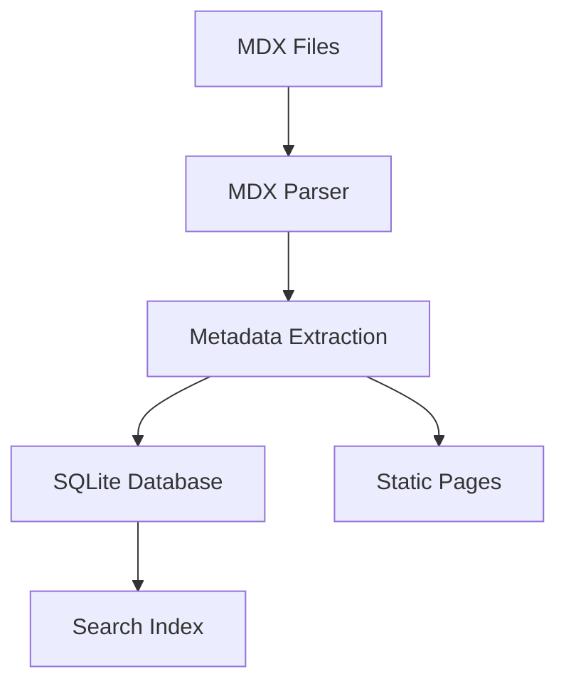
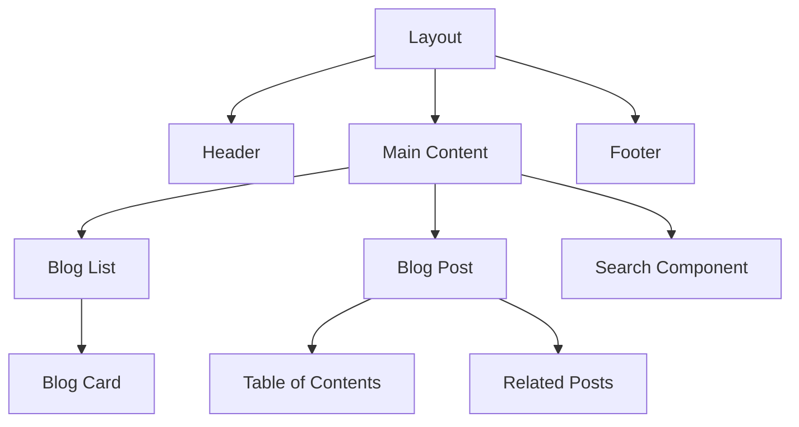
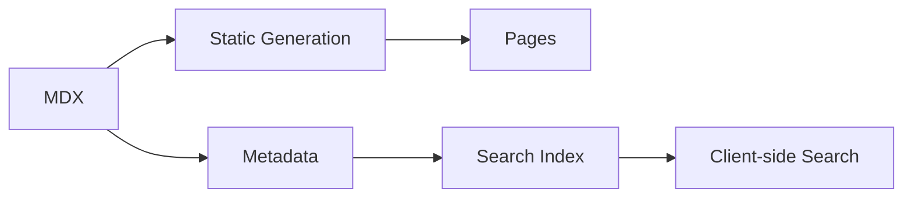

# System Patterns

## Directory Structure
```
/
├── app/               # Next.js app router pages
├── components/        # React components
│   ├── ui/           # shadcn/ui components
│   └── blog/         # Blog specific components
├── content/          # MDX blog posts
├── lib/              # Utility functions
│   ├── db/          # Database related code
│   └── mdx/         # MDX processing
├── public/           # Static assets
└── styles/          # Global styles
```

## Core Patterns

### Content Management


### Page Generation
- Static Site Generation (SSG) for all content pages
- Dynamic metadata generation
- Incremental Static Regeneration for content updates

### Component Architecture


### Data Flow


## Reusable Patterns

### SEO Components
- Metadata component for consistent SEO
- OG Image generation
- Structured data injection

### Content Components
- YouTube video embed
- Code syntax highlighting
- Table of contents generation
- Related posts suggestion

### UI Patterns
- Responsive layout system
- Theme switching
- Loading states
- Error boundaries